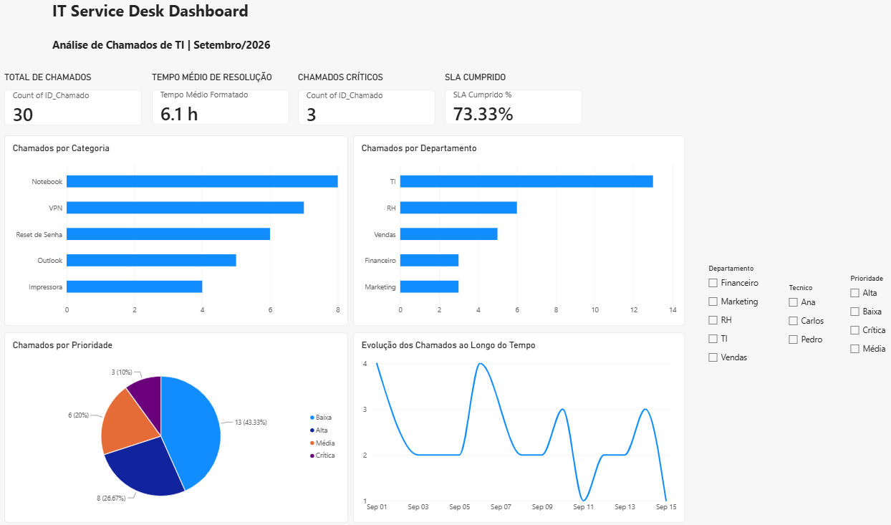

# IT Service Desk Dashboard

## 📸 Dashboard
 

## 📊 Sobre o Projeto

Dashboard desenvolvido em Power BI para análise de chamados de TI.

O objetivo foi praticar conceitos de análise de dados e visualização de indicadores operacionais de um ambiente de Service Desk.

## 🚀 Funcionalidades

- Total de chamados
- Tempo médio de resolução
- Chamados críticos
- SLA cumprido (%)
- Chamados por categoria
- Chamados por prioridade
- Chamados por departamento
- Evolução dos chamados ao longo do tempo
- Filtros interativos

## 🛠️ Tecnologias Utilizadas

- Power BI
- CSV
- Análise de Dados

## 📂 Arquivos do Projeto

- `IT-Service-Desk-Dashboard.pbix`
- `tickets.csv`
- `dashboard.png`

## 🎯 Objetivo

Praticar conhecimentos em:

- Power BI
- Visualização de Dados
- Service Desk
- Indicadores Operacionais
- Análise de Dados

## 👨‍💻 Autor

Vitor Fernandes
www.linkedin.com/in/vitorsfv
